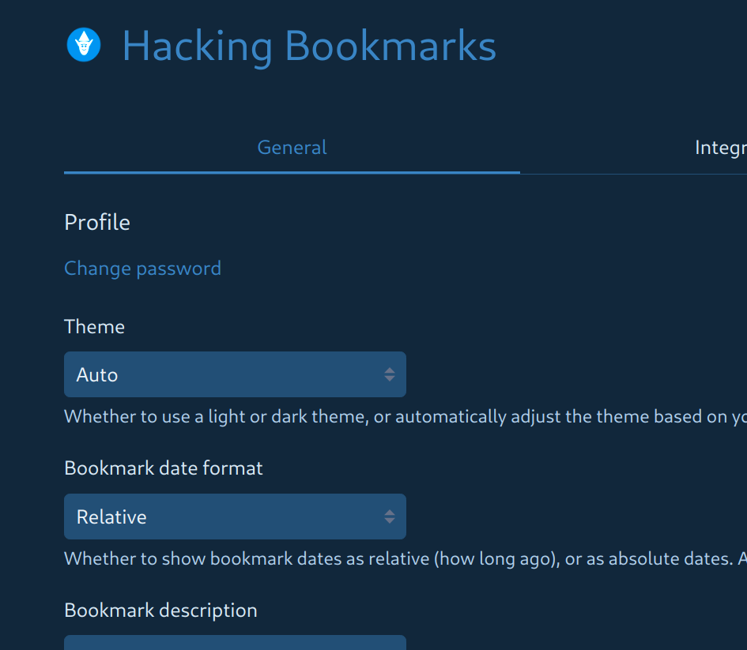

# Linkding Bookmarks Manager

A Docker container management script for running multiple instances of the [linkding](https://github.com/sissbruecker/linkding) bookmark manager.  Includes customizable title, logo and color theme.

## Installation

1. Clone this repository:
```bash
cd /opt
git clone https://git.ucommandit.org/uci/uci-linkding-bookmarks.git bookmarks
cd bookmarks
```

> **Quick Start for CSS Only:**  
> If you just want to generate custom CSS for an existing linkding instance:
> ```bash
> ./bm css anyname   # Generates CSS files for copy/paste into linkding settings
> ```
> see the [Customization](#customization) section below.

2. Create a branch for your machine:
```bash
git checkout -b my-machine-name
```

3. Edit .gitignore to track your configurations:
```bash
# Remove or comment out these lines:
# /assets/*
# /containers/*
```

4. Start a new bookmarks container:
```bash
./bm run mybookmarks
```

> On first run, you'll be prompted to:
> - Set custom port (or auto-detect available)
> - Configure data storage location
> - Set admin username/password

5. Running ok?  Commit your branch:
```bash
git add .
git commit -m "feat: add first bookmarks configuration/instance"
[ create a remote repo, set the remote]
git push myremote my-machine-name
```

> **Data Storage Note:**  
> By default, bookmark data in `bookmarks/` is not committed (recommended).  
> To version control your bookmarks, either:
> - Remove `bookmarks/` from .gitignore (not recommended)
> - Use `HOST_VOLUME_DIR` to store data in a backed-up location (recommended)


## Features

- Manage multiple bookmark containers on the same machine
- Automatic port conflict detection and resolution
- Environment variable persistence
- Volume management for persistent data
- Custom logo and theme support

## Usage

```bash
bm <command> [options] <bookmarks-name>
```

### Commands requiring bookmarks name:
- `run`      Create and start the bookmarks container interactively
- `start`    Start container in detached mode (same as: run -d)
- `stop`     Stop the running bookmarks container
- `restart`  Restart the bookmarks container
- `log`      Show logs from the bookmarks container
- `config`   Display the Docker Compose configuration
           -e        Configure environment variables (port, paths, credentials)
- `admin`    Run commands in the container:
           -s        Open an interactive shell
           -x        Execute a shell command
           [args]    Run Django manage.py commands (default)
- `delete`   Delete container, environment file and data (DANGEROUS!)

### Commands with optional bookmarks name:
- `status`   Show status of all instances or specific instance
           -q        Quiet mode - only output running instance names

### Commands that don't use bookmarks name:
- `upgrade`  Upgrade all instances to latest linkding version
- `help`     Show this help message

### Examples
```bash
bm run mybookmarks          # Create and start container interactively
bm run -d mybookmarks      # Create and start container in background
bm start mybookmarks       # Start container in background
bm stop mybookmarks        # Stop the container
bm status                  # Show all instances status
bm status -q              # List running instances (for scripts)
bm status mybookmarks     # Check specific instance status
bm upgrade               # Upgrade all instances to latest version
```

### Notes
- First run will create a .env file if port 9090 is in use
- assets/custom-logo.png will replace default logo if present
- Generated CSS files are named: <bookmarks>-custom[-light|-dark].css

## Data Management

### Customization
Place `custom-logo.png` in the `assets` folder to replace the default logo.

Custom title and themes are available through the `css` command:
```bash
./bm css mybookmarks
```



The generated CSS can be pasted into the Settings [General] page of your bookmarks instance.

### Data Location
Bookmark data is stored in:
- `./bookmarks/<name>/` by default
- Configurable via `HOST_VOLUME_DIR` or full custom path

### Deletion
The delete command removes:
1. Container instance
2. Environment configuration
3. All bookmark data

Requires two confirmations:
```bash
./bm delete mybookmarks
```

## Configuration

### Environment Variables
Basic settings configured through `bm config -e`:
- `HOST_PORT` - Container port (default: 9090)
- `HOST_VOLUME_DIR` - Base data directory
- `HOST_VOLUME_PATH` - Full custom data path
- `LD_SUPERUSER_NAME` - Admin username
- `LD_SUPERUSER_PASSWORD` - Admin password

Additional Linkding options can be added manually to the env file. See `example.env` for available settings such as:
- Context path
- Authentication proxy support
- URL validation
- Background tasks
- CSRF trusted origins

For full documentation of options, see [Linkding Options](https://linkding.link/options/)

## Requirements

- Docker
- docker-compose
- netcat (for port checking)
- xclip (optional, for clipboard support)
- current user in docker group