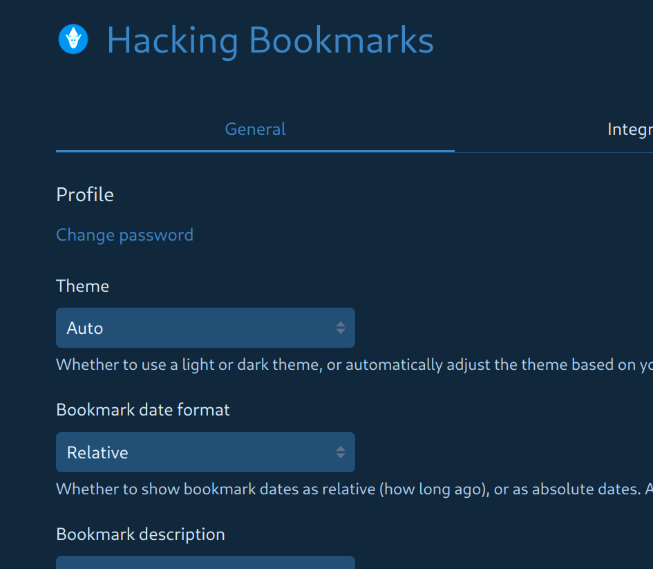

# Linkding Bookmarks Manager

A Docker container management script for running multiple instances of the [linkding](https://github.com/sissbruecker/linkding) bookmark manager.

## Installation

1. Clone this repository:
```bash
git clone https://github.com/yourusername/linkding-bookmarks.git
cd linkding-bookmarks
```

2. Create a branch for your machine:
```bash
git checkout -b my-machine-name
```

3. Edit .gitignore to track your configurations:
```bash
# Remove or comment out these lines:
# /assets/*
# /containers/*
```

4. Start the container:
```bash
./bm run mybookmarks
```

> On first run, you'll be prompted to:
> - Set custom port (or auto-detect available)
> - Configure data storage location
> - Set admin username/password


5. Commit your branch:
```bash
git add .
git commit -m "feat: add my machine configuration"
git push origin my-machine-name
```

> **Data Storage Note:**  
> By default, bookmark data in `bookmarks/` is not committed (recommended).  
> To version control your bookmarks, either:
> - Remove `bookmarks/` from .gitignore (not recommended)
> - Use `HOST_VOLUME_DIR` to store data in a backed-up location (recommended)


## Features

- Manage multiple bookmark containers on the same machine
- Automatic port conflict detection and resolution
- Environment variable persistence
- Volume management for persistent data
- Custom logo and theme support

## Usage

Commands:
- `run`       Create and start container interactively
- `start`     Start container in detached mode
- `stop`      Stop the running container
- `restart`   Restart the container
- `log`       Show logs from the container
- `config`   Display the Docker Compose configuration
  - `-e` Configure environment variables (port, paths, credentials)
- `css`       Generate custom CSS theme
- `admin`     Run commands in container:
  - `-s`      Open interactive shell
  - `-x`      Execute shell command
  - `[args]`  Run Django manage.py commands
- `delete`    Delete container and data (requires confirmation)

## Examples

```bash
./bm run personal           # Create and start container
./bm start work            # Start container in background
./bm config -e personal    # Configure environment
./bm css personal         # Generate custom theme
./bm admin -s personal    # Open shell in container
```

## Data Management

### Customization
Place `custom-logo.png` in the `assets` folder to replace the default logo.

Custom title and themes are available through the `css` command:
```bash
./bm css mybookmarks
```



The generated CSS can be pasted into the Settings [General] page of your bookmarks instance.

### Data Location
Bookmark data is stored in:
- `./bookmarks/<name>/` by default
- Configurable via `HOST_VOLUME_DIR` or full custom path

### Deletion
The delete command removes:
1. Container instance
2. Environment configuration
3. All bookmark data

Requires two confirmations:
```bash
./bm delete mybookmarks
```

## Configuration

### Environment Variables
Basic settings configured through `bm config -e`:
- `HOST_PORT` - Container port (default: 9090)
- `HOST_VOLUME_DIR` - Base data directory
- `HOST_VOLUME_PATH` - Full custom data path
- `LD_SUPERUSER_NAME` - Admin username
- `LD_SUPERUSER_PASSWORD` - Admin password

Additional Linkding options can be added manually to the env file. See `example.env` for available settings such as:
- Context path
- Authentication proxy support
- URL validation
- Background tasks
- CSRF trusted origins

For full documentation of options, see [Linkding Options](https://linkding.link/options/)

## Requirements

- Docker
- docker-compose
- netcat (for port checking)
- xclip (optional, for clipboard support)
- current user in docker group